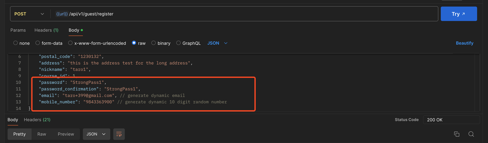
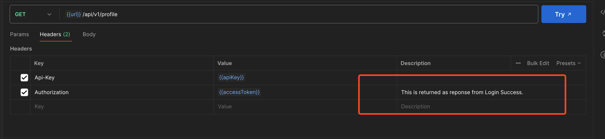
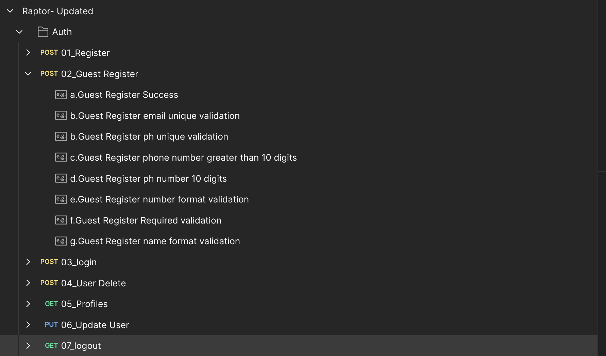
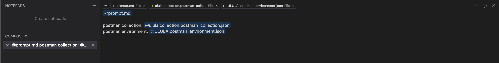
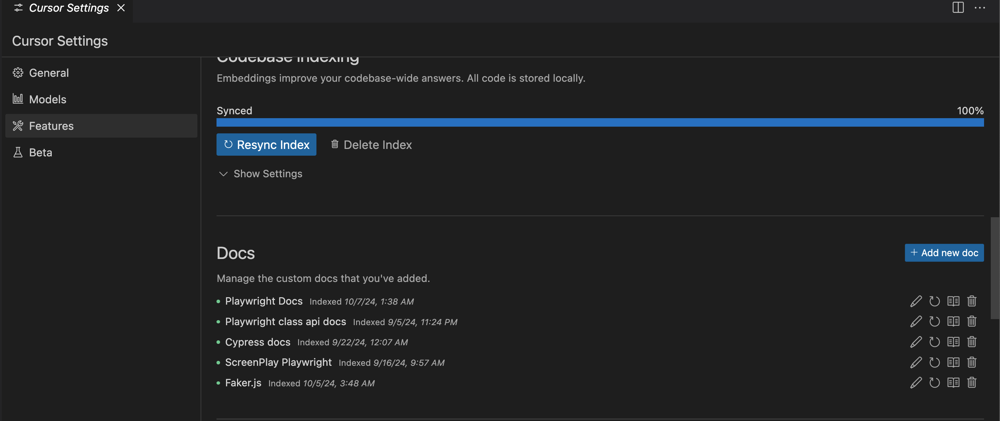

# Playwright API Test Automation Template

## Getting started

- Clone the repository.
- Run setup.sh or setup.bat to install dependencies.
- Add your postman collection and environment json file on the postman folder.

## Setting up Postman Collection and Environment

- Test Scenarios should be saved as an example for each endpoint in the postman collection json file.
- Environment variables should be saved in the postman environment json file.
- Define your dynamic data requirements as comments on the posman body of endpoints.

- For endpoint which require data from another endpoint, you need to add description comments as well.

- Remove any unnecessary variables from the postman environment file and the collection file. Make sure to delete them, not just disable.
- Save the collection in ordered list format. It should arranged according to the sequence in which tests should to be run.

## Generating the API Test Code

- Run `prompt.md` file to generate the API test code.

**Note:** The prompt is not perfect but will generate draft code. You may need to review and refine the generated code to ensure it meets your specific requirements.

## Additional Cursor IDE Setup

- Make sure to enable `Composer` and `Cursor Tab` from cursor Settings >> Features.
- Make sure to enable `Enable .cursorrules file` from Settings >> General.
- You can [index custom documentation](https://docs.cursor.com/context/@-symbols/@-docs) on cursor for better code generation.

